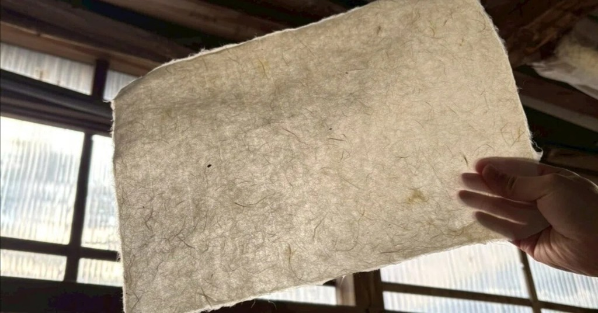
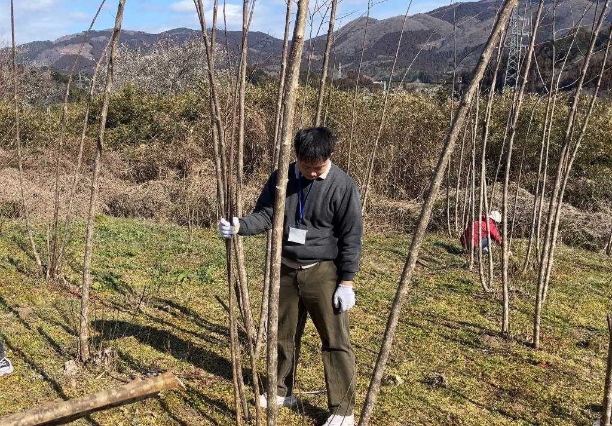
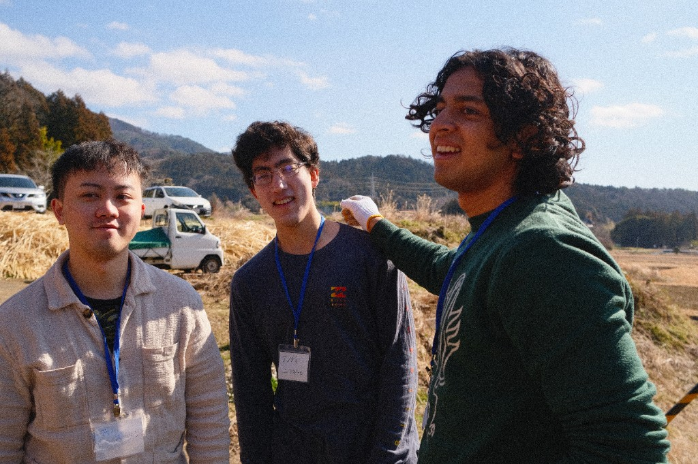
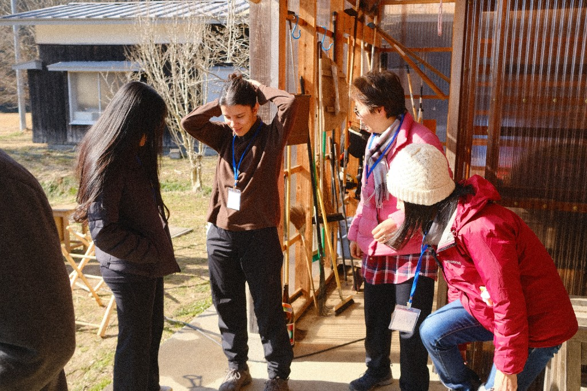
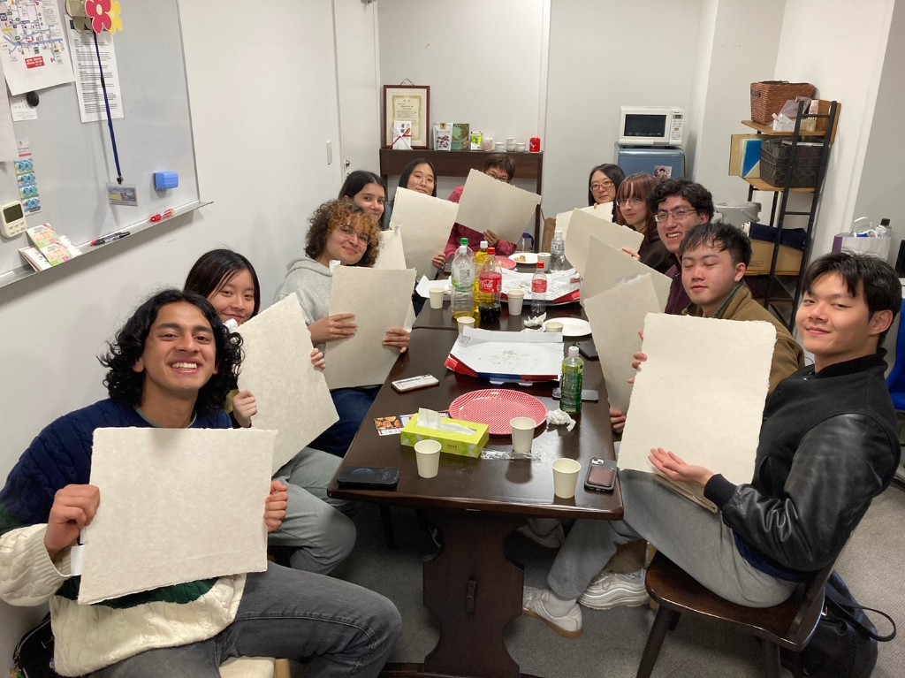

Three Februarys ago, I went to Iwaki in Fukushima Prefecture, Japan to learn how to make **washi**. Washi is traditional Japanese paper.

It's used in traditional Japanese shoji screens. I liked the look of it so much, I made the centerpiece of this website a digital recreation of it.

*The texture of washi is really unique; rough, thick, yet see through.*

It's made out of **kozo**, or the paper mulberry plant.

*This is my friend Sicun harvesting a kozo.*

*Taking a break from kneading and sifting the kozo fibers.*

*Finished product 🙌*
